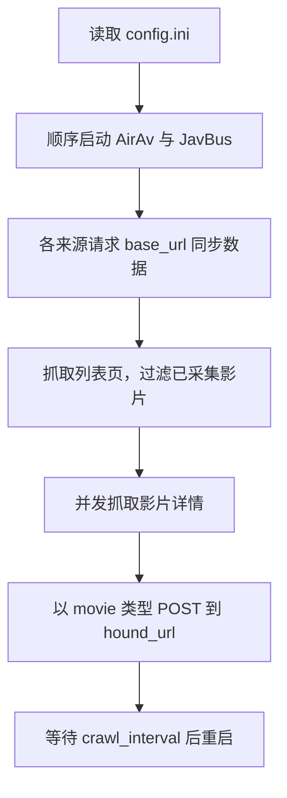

# AV 爬虫

## 概述

AV 爬虫从多个影片站点采集影片详情、演员和分类关联数据，并将结果提交到外部接收端。模块不保存本地状态：已采集 ID、待订阅演员及可抓取分类均由 `base_url` 返回的配置数据决定。

## 业务背景

不同来源的页面字段和分页规则不同。模块以统一的影片结构交给下游服务，并通过下游返回的已采集列表避免重复提交。

## 核心概念

| 名称 | 说明 |
| --- | --- |
| 影片 | 单条影片资料，含标识、标题、封面、样图及各类关联信息。 |
| 来源 | 爬虫站点标识，当前包括 `airav`、`javbus` 和已保留但未启用的 `avmoo`。 |
| 已采集 ID | `base_url` 返回的 `ids`，用于跳过重复影片。 |
| 订阅演员 | JavBus 中 `subscribe >= 1` 且 ID 长度不超过 6 的演员；会继续抓取其列表页。 |
| 状态 | JavBus 同步数据中的启用标记；当前仅已启用的系列会进入列表抓取，片商和类别仅输出日志。 |

## 运行流程

`main.py` 当前启用 `AirAvSpider` 与 `JavBusSpider`；`AvmooSpider` 的启动代码已保留但被注释，因此不会在默认任务中执行。

### 来源与范围

| 来源 | 列表范围 | 并发方式 | 分页规则 |
| --- | --- | --- | --- |
| AirAv | 配置的起始列表 | 2 个线程 | 发现下一页链接时继续。 |
| JavBus | 起始列表、已订阅且 ID 长度不超过 6 的演员、已启用且 ID 长度不超过 6 的系列 | 2 个线程 | 仅当列表项包含两个日期节点，且第二个日期不早于 `2023-12-15` 时继续下一页。 |
| Avmoo | 已实现，默认未启用 | 2 个线程 | 演员首页始终提交演员信息；仅 `subscribe >= 1` 时解析该演员的影片并继续翻页。 |

JavBus 对片商与类别会读取并打印启用项，但当前相应的列表抓取调用处于注释状态，因此实际不会抓取这些范围。

JavBus 会为 `www.javbus.com` 设置 `existmag=all` Cookie。日期过滤仅作用于恰好包含两个日期节点的条目：第二个日期为 `0000-00-00` 或早于 `2023-12-15` 时跳过；没有两个日期节点的条目仍可进入详情抓取，但不会触发下一页。

## 类定义

### `BaseSpider`

| 属性或方法 | 说明 |
| --- | --- |
| `baseUrl` | 同步数据服务地址。 |
| `houndUrl` | 接收影片及演员扩展数据的服务地址。 |
| `startUrl` | 当前来源的起始列表地址。 |
| `host` | 从起始地址解析出的协议和域名，用于拼接来源内链接。 |
| `request(url)` | 以随机浏览器请求头、30 秒超时请求页面；失败后每隔 5 秒重试，初始尝试计数为 `1`，在计数达到 `10` 前最多发出 9 次请求。 |
| `parseHref(href, base_url)` | 使用当前页面地址将相对链接转为绝对 URL。 |
| `sendMovieData(movie)` | 将一条影片封装为 `movie` 类型表单请求并提交。 |
| `_newMovie()` | 创建字段完整的默认影片对象。 |

### 来源爬虫

| 类 | `source` | `start()` 的当前职责 |
| --- | --- | --- |
| `AirAvSpider` | `airav` | 读取同步数据后，从配置的列表页抓取影片；每页以 2 个工作线程抓取详情。 |
| `JavBusSpider` | `javbus` | 读取同步数据后，抓取起始列表、已订阅演员及已启用系列；详情由单个、最多 2 个工作线程的执行器处理。 |
| `AvmooSpider` | `avmoo` | 提供起始列表和演员列表抓取能力；默认入口未启用。 |

所有来源都会跳过同步数据中的已采集影片 ID。列表页和详情页请求失败时，解析方法会返回；但来源启动时对 `base_url` 的返回值不做失败判断，无法取得同步数据时可能在 JSON 解析阶段异常退出。

### 影片对象

| 字段 | 类型 | 默认值 | 说明 |
| --- | --- | --- | --- |
| `id` | string | 空字符串 | 来源站点中的影片标识。 |
| `source` | string | 当前来源 | `airav`、`javbus` 或 `avmoo`。 |
| `title` | string | 空字符串 | 影片标题。 |
| `des` | string | 不适用 | AirAv 详情页中提取的影片描述；基础默认对象及其他来源不会写入该字段。 |
| `poster` | string | 空字符串 | 封面图地址。 |
| `serial_number` | string | 空字符串 | 识别码。 |
| `samples` | array | `[]` | 样图地址列表。 |
| `duration` | string | 空字符串 | 时长。 |
| `release_date` | string | `1990-01-01` | 发行日期。 |
| `stars`、`directors`、`genres`、`series`、`studios`、`labels` | array | `[]` | 演员、导演、类别、系列、片商和厂牌关联。 |

关联对象使用 `id` 与 `name` 字段；演员对象额外包含 `source` 和 `avatar`。

## 接口说明

### 同步数据接口

| 项目 | 说明 |
| --- | --- |
| 请求地址 | 配置项 `base_url` 的值 |
| 请求方法 | `GET` |
| 关键响应字段 | `ids`、`stars`、`studios`、`series`、`genres` |

其中 `ids` 用于三个来源的影片去重。JavBus 会读取全部扩展数据，但当前只有 `stars` 和 `series` 会进入列表抓取，`studios` 与 `genres` 只输出启用项日志；AirAv 当前只按起始列表抓取，Avmoo 使用 `stars` 抓取演员列表。

### 采集结果接口

| 项目 | 说明 |
| --- | --- |
| 请求地址 | 配置项 `hound_url` 的值 |
| 请求方法 | `POST` |
| 请求格式 | 表单数据 |
| 影片字段 | `type=movie`、`movies=<影片数组 JSON>` |
| 演员扩展字段 | `type=star`、`star_id=<演员 ID>`、`infos=<信息数组 JSON>`；当前仅 Avmoo 在演员首页提交此请求。 |

接收端请求不传入超时参数，也不调用 `raise_for_status()` 或依据响应状态重试；当前代码只打印响应内容。

## 配置与部署

| 配置项 | 类型 | 必填 | 说明 |
| --- | --- | --- | --- |
| `crawl_interval` | integer | 是 | 下一轮任务前的等待秒数。 |
| `base_url` | string | 是 | 返回已采集 ID 和扩展采集范围的服务地址。 |
| `hound_url` | string | 是 | 接收采集结果的服务地址。 |
| `start_url` | string | 是 | Avmoo 的起始列表地址；尽管默认任务未启用 Avmoo，入口仍会读取此配置项。 |
| `javbus_url` | string | 是 | JavBus 起始列表地址。 |
| `airav_url` | string | 是 | AirAv 起始列表地址。 |

容器基础镜像为 `docker.1ms.run/python:3.13-slim`。构建阶段会清理 APT 索引、升级 `pip`、将默认索引设为清华镜像，并以该镜像安装依赖且不保留缓存。`compose.yaml` 将当前目录挂载到容器 `/app`，并以 `python main.py` 作为启动命令。

## 常见问题

- 站点页面结构或字段语言变化会使 XPath 选择器无法命中；修复时需要同时核对影片对象字段是否仍保持完整。
- `request` 对非 `200` 响应及异常会重试；计数达到 `10` 时返回失败值。列表页和详情页会跳过该资源，但 `base_url` 请求失败不会被来源启动方法单独处理。
- 文档不会记录真实服务地址、Cookie 或其他敏感运行配置；请通过本地 `config.ini` 提供。
