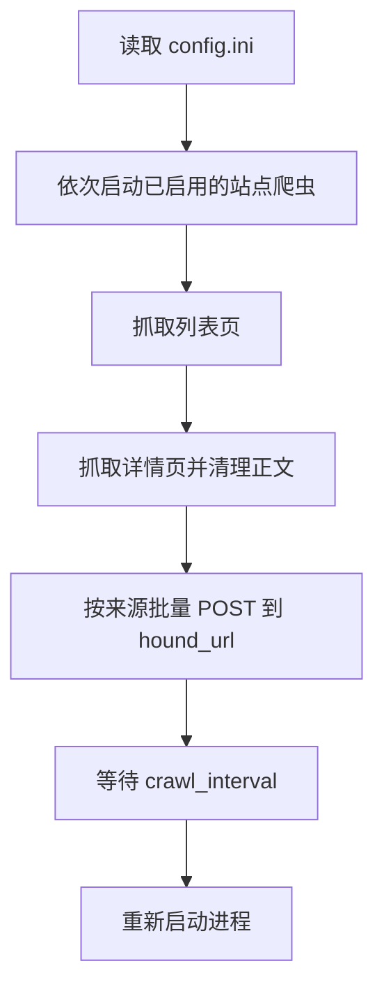

# 排球新闻爬虫

## 概述

排球新闻爬虫从多个排球资讯站点抓取新闻列表和正文，清理不需要的页面元素后，将新闻以批次形式提交给接收端。该模块只负责采集与格式化，不负责新闻持久化或去重。

## 业务背景

不同资讯站点的页面结构和发布时间格式并不一致。模块通过站点专属爬虫统一输出新闻字段，使下游接收端能够按来源保存和展示内容。

## 核心概念

| 名称 | 说明 |
| --- | --- |
| 新闻对象 | 提交给接收端的一条新闻，包含来源、标题、正文、发布时间等字段。 |
| `hound_url` | 接收新闻批次的外部服务地址。 |
| 批次 | 爬虫累计一定数量的新闻后，以 `news` 表单字段一次提交的集合。不同来源的批次大小不同。 |
| `crawl_interval` | 本轮抓取结束后，下次运行前的等待秒数。 |
| 请求计数 | `request()` 的内部计数从 `1` 开始；计数达到 `5` 前最多发出 4 次请求。 |

## 运行流程



`main.py` 当前依次启用以下来源：

| 类 | `source` | 站点 | 特殊行为 |
| --- | --- | --- | --- |
| `VolleyballChinaSpider` | `volleyballchina` | 中国排球协会 | 使用 Selenium 无头 Chrome 获取动态详情页。 |
| `SportsVSpider` | `sportsv` | SportsV | 最多抓取前 2 页，每条新闻单独提交。 |
| `VolSportsSpider` | `volsports` | Vol Sports | 最多抓取前 2 页。 |
| `FIVBSpider` | `fivb` | 国际排联 | 将英文日期规范化为 `YYYY-MM-DD`。 |
| `SportsSinaSpider` | `sports.sina` | 新浪体育 | 清理声明和广告区域。 |

`VolleyChinaSpider` 已实现，但当前未在 `main.py` 中启动。

`VolleyballChinaSpider` 顺序抓取两个硬编码分类列表；`FIVBSpider` 与 `SportsSinaSpider` 当前只抓取入口列表页，没有翻页逻辑。

## 类定义

| 类 | 主要职责 | 当前是否由入口启动 |
| --- | --- | --- |
| `VolleyballSpider` | 抽象基类，提供随机请求头、HTTP 请求、协议相对或根相对链接转换和新闻提交。 | 否 |
| `VolleyballChinaSpider` | 通过 Selenium 获取中国排球协会动态详情页。 | 是 |
| `SportsVSpider` | 抓取 SportsV 前 2 页新闻。 | 是 |
| `VolSportsSpider` | 抓取 Vol Sports 前 2 页新闻。 | 是 |
| `FIVBSpider` | 抓取国际排联新闻并转换英文日期。 | 是 |
| `SportsSinaSpider` | 抓取新浪体育排球新闻并移除声明、广告区域。 | 是 |
| `VolleyChinaSpider` | 抓取 VolleyChina 列表和正文。 | 否 |

`VolleyballSpider.request()` 未设置显式超时，仅对超时和连接错误递归重试。初始计数为 `1`，计数达到 `5` 时停止，因此最多发出 4 次请求；`4xx/5xx` 响应和其他请求异常直接返回失败值。`parse_href()` 只补全以 `//` 或 `/` 开头的链接，不处理普通相对路径。每个来源的 `start()`、`parse_list()` 和 `parse_item()` 负责适配本来源的列表、详情及正文清理规则。

## 新闻数据与接口说明

所有来源均将新闻对象序列化为 JSON 字符串，并以表单 POST 方式发送：

| 项目 | 说明 |
| --- | --- |
| 请求地址 | 配置项 `hound_url` 的值 |
| 请求方法 | `POST` |
| 表单字段 | `news` |
| 字段值 | 新闻对象数组的 JSON 字符串 |

新闻对象的统一字段如下。个别站点无法提供的字段会保留为空字符串。

接收端请求只打印响应内容，不调用 `raise_for_status()` 或依据响应状态重试；因此 HTTP 响应是否表示接收成功由接收端约定，当前爬虫不会验证。

| 字段 | 类型 | 说明 |
| --- | --- | --- |
| `source` | string | 来源标识。 |
| `title` | string | 新闻标题。 |
| `url` | string | 原文地址。 |
| `author` | string | 作者或默认发布机构。 |
| `desc` | string | 摘要。 |
| `poster` | string | 封面图地址。 |
| `content` | string | 清理后的 HTML 正文。 |
| `publish_time` | string | 来源页面提供的发布时间。 |

当前批次大小由来源实现决定：`SportsVSpider` 每条提交；`VolSportsSpider` 每 5 条提交；`VolleyballChinaSpider`、`FIVBSpider` 和 `SportsSinaSpider` 每 10 条提交。列表结束时，未满批次的剩余新闻也会提交。

示例：

```json
{
  "news": "[{\"source\": \"fivb\", \"title\": \"...\", \"url\": \"https://...\", \"author\": \"国际排联\", \"desc\": \"...\", \"poster\": \"https://...\", \"content\": \"<div>...</div>\", \"publish_time\": \"2026-07-11\"}]"
}
```

## 配置与部署

| 配置项 | 类型 | 必填 | 说明 |
| --- | --- | --- | --- |
| `crawl_interval` | integer | 是 | 下一轮任务前的等待秒数。 |
| `hound_url` | string | 是 | 接收新闻的服务地址。 |

各新闻来源 URL 当前硬编码在对应爬虫类中，不能通过 `config.ini` 修改。

容器基础镜像为 `docker.1ms.run/python:3.13-slim`。构建时只复制 `requirements.txt`，并通过清华镜像以 `--no-cache-dir` 安装依赖；当前 Dockerfile 不会清理 APT 索引、升级 `pip` 或设置 `pip` 默认索引。`compose.yaml` 会将当前目录挂载到容器 `/app`，入口命令为 `python main.py`。

## 常见问题

- 中国排球协会来源依赖 Chrome WebDriver；容器镜像仅安装 Python 依赖，运行环境还需要具备可用的 Chrome 与对应驱动。
- 某个站点请求超时或连接失败时，基础请求逻辑最多发出 4 次请求后跳过该请求；其他站点仍会继续执行。
- 页面结构变化会导致选择器无法命中。调整选择器前，应同步检查本文件中的字段和正文清理规则是否仍准确。
